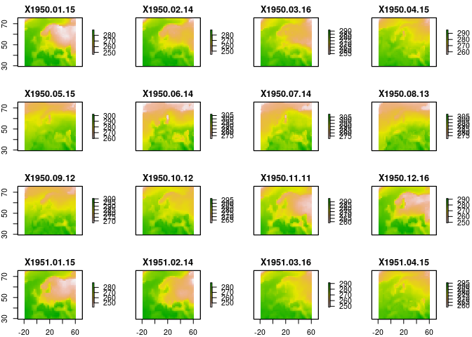
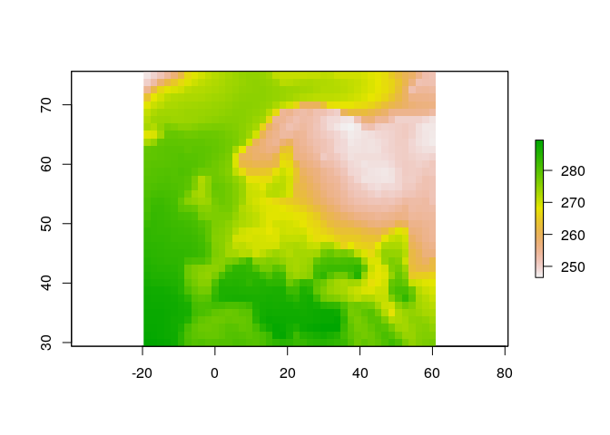

Hydrologické modelování dopadů klimatických změn (2018/2019)
================

-   [Zadání projektu](#zadání-projektu)
-   [Blok 1 - Modelování hydrologické bilance a dopadů klimatické změny](#blok-1---modelování-hydrologické-bilance-a-dopadů-klimatické-změny)
    -   [Data](#data)
    -   [Model Bilan](#model-bilan)
    -   [Cvičení 1: Hydrologická bilance](#cvičení-1-hydrologická-bilance)
    -   [Nápověda](#nápověda)
    -   [Cvičení 2: Dopady klimatické změny](#cvičení-2-dopady-klimatické-změny)

<style>
 pre,code {
  font-size:small
 }
</style>
### Zadání projektu

##### Pro vybrané povodí zjistěte očekávané změny hydrologické bilance a vyhodnoťte účinek opatření v podobě vodní nádrže a zvýšení retence půdy.

------------------------------------------------------------------------

Blok 1 - Modelování hydrologické bilance a dopadů klimatické změny
------------------------------------------------------------------

Cílem tohoto bloku je získání dat pro vybrané povodí, kalibrace modelu Bilan a odhad dopadů klimatické změny.

#### Data

Soubor se srážkami, teplotou, odtokem a dalšími informacemi pro vybraná pvodí jsou v adresáři data. Shapefile s rozvnodnicemi jednotlivých povodí je na stejném místě.

``` r
library(data.table)
library(rgdal)


## zmente cestu
setwd('./data')

## nactete data
dta = readRDS('free_data.rds')

## nactete rozvodnice
pov = readOGR('povodi.shp')
```

    ## OGR data source with driver: ESRI Shapefile 
    ## Source: "/home/mha/GIT/KZ2019/data/povodi.shp", layer: "povodi"
    ## with 28 features
    ## It has 14 fields
    ## Integer64 fields read as strings:  ID

Seznam povodí je obsažen v atributové tabulce shapefilu povodi.shp, tj. `pov@data`. Struktura dat je následující:

-   `DBCN`: databankové číslo
-   `AREA`: plocha povodí
-   `DTM`: datum
-   `Q`: průtok
-   `PR`: srážky
-   `TAS`: teplota
-   `R`: odtok

#### Model Bilan

Manuál modelu je ke stažení [zde](http://bilan.vuv.cz/bilan/wp-content/uploads/2015/03/bilan_man_cs_2015-06-23.pdf). Soubor k instalaci je v adresáři bilan. Soubor je nutné stáhnout a nainstalovat.

V Rku vytvoříme novou instanci modelu Bilan pomocí funkce `bil.new`

``` r
library(bilan)
```

    ## Loading required package: Rcpp

``` r
args(bil.new)
```

    ## function (type, file = NULL, use_data = TRUE, data = NULL, modif = "none", 
    ##     period = 0, ...) 
    ## NULL

kde `type` určuje typ modelu (`m` - měsíční, `d` - denní), `file` umožňuje vytvořit model na základě **výstupního** souboru z modelu Bilan, `data` umožňuje vytvořit model na základě **vstupního** souboru do modelu Bilan.

Tedy například pro povodí s `DBCN==017000`, píšeme

``` r
b = bil.new(type='d', data = dta[DBCN == '017000' & !is.na(R)])
```

    ## Warning in evalq((function (..., call. = TRUE, immediate. = FALSE, noBreaks. = FALSE, : Unknown variable 'DBCN'. Omitted.

    ## Warning in evalq((function (..., call. = TRUE, immediate. = FALSE, noBreaks. = FALSE, : Unknown variable 'AREA'. Omitted.

    ## Warning in evalq((function (..., call. = TRUE, immediate. = FALSE, noBreaks. = FALSE, : Unknown variable 'Q'. Omitted.

Optimalizace parametrů je možná pomocí příkazu `bil.optimize`, nicméně nejdříve je nutné odhadnout evapotranspiraci pomocí funkce `bil.pet`.

``` r
bil.pet(b)
res = bil.optimize(b)
head(res)
```

    ##           DTM   P         R        RM        BF  B         DS          DR
    ## 1: 1961-01-01 0.1 0.5731969 0.3577500 0.3577500 NA 0.00000000 0.000000000
    ## 2: 1961-01-02 0.0 0.5731969 0.3551903 0.3551903 NA 0.00000000 0.000000000
    ## 3: 1961-01-03 1.6 0.5731969 0.3526489 0.3526489 NA 0.00000000 0.000000000
    ## 4: 1961-01-04 0.9 0.5373721 0.3598553 0.3501257 NA 0.05528006 0.009729567
    ## 5: 1961-01-05 0.3 0.5373721 0.3708314 0.3628142 NA 0.04555050 0.008017115
    ## 6: 1961-01-06 0.0 0.5015473 0.3668244 0.3602183 NA 0.03753338 0.006606062
    ##           PET          ET       SW          SS       GS      INF     PERC
    ## 1: 0.09289905 0.092899045 91.72672 0.007100956 49.64225 0.000000 0.000000
    ## 2: 0.09035797 0.007100956 91.72672 0.000000000 49.28706 0.000000 0.000000
    ## 3: 0.14228528 0.142285283 91.72672 1.457714741 48.93441 0.000000 0.000000
    ## 4: 0.17892902 0.178929021 91.72672 0.000000000 50.70779 2.178786 2.178786
    ## 5: 0.13159012 0.131590118 91.72672 0.168409894 50.34498 0.000000 0.000000
    ## 6: 0.13604419 0.136044192 91.72672 0.032365702 49.98476 0.000000 0.000000
    ##          RC          T  H WEI
    ## 1: 0.000000 -2.0586942 NA   1
    ## 2: 0.000000 -2.1586943 NA   1
    ## 3: 0.000000 -0.5586942 NA   1
    ## 4: 2.123506  0.5413058 NA   1
    ## 5: 0.000000 -0.9586942 NA   1
    ## 6: 0.000000 -0.8586942 NA   1

Ve výše uvedeném případě jsme použili defaultní nastavení jak v případě funkce `bil.pet` (zde je možné nastavit způsob odhadu a jeho parametry - viz `?bil.pet`), tak i v případě `bil.optimize`. Parametry optimalizace je možné nastavit pomocí funkce `bil.set.optim`. Zejména můžeme ovlivnit

-   metodu optimalizace - `method`
-   `BS` - půlení intervalu
-   `DE` - diferenciální evoluce
-   kritéria optimalizace - `crit`
-   `MSE` - střední kvadratická chyba
-   `NS` - Nash-Sutcliffe
-   `LNNS` - log Nash-Sutcliffe
-   `MAPE` - střední procentuální chyba
-   `MAE` - střední absolutní chyba
-   počet iterací `max_iter`

Po provedení optimalizace můžeme zobrazit parametry pomocí příkazu `bil.get.params`:

``` r
bil.get.params(b)
```

    ##   name   current lower upper initial
    ## 1  Spa 91.726719     0 200.0   20.00
    ## 2  Alf  0.176005     0   1.0    0.30
    ## 3  Dgm  3.467782     0 200.0    5.00
    ## 4  Soc  0.042930     0   1.0    0.30
    ## 5  Mec  0.011645     0   1.0    0.05
    ## 6  Grd  0.007155     0   0.5    0.05

``` r
bil.write.file(b, 'vystup.bil')
```

Parametry je rovněž možné načíst z Bilanovského výstupního souboru:

``` r
bil.read.params.file(b, 'vystup.bil')
bil.get.params(b)
```

    ##   name   current lower upper   initial
    ## 1  Spa 91.726700     0 200.0 91.726700
    ## 2  Alf  0.176005     0   1.0  0.176005
    ## 3  Dgm  3.467780     0 200.0  3.467780
    ## 4  Soc  0.042930     0   1.0  0.042930
    ## 5  Mec  0.011645     0   1.0  0.011645
    ## 6  Grd  0.007155     0   0.5  0.007155

### Cvičení 1: Hydrologická bilance

------------------------------------------------------------------------

1.  vyberte jedno povodí, vytvořte proměnnou obsahující data jen pro vybrané povodí (jak hydroklimatická data, tak rozvodnici povodí).

2.  převeďte data do měsíčního časového kroku

3.  vytvořte model Bilan, vložte do něj data a nakalibrujte

4.  vyhodnoťte kalibraci

-   v protokolu bude: (1) obrázek vybraného území, (2) základní hydroklimatické charakteristiky, (3) vyhodnocení kalibrace modelu Bilan, (4) tabulka s parametry.

------------------------------------------------------------------------

### Nápověda

#### Práce s `data.table`

-   viz `data.table.md`
-   agregace na roky např. `ydta = dta[, .(DTM = DTM[1], P = sum(P), T = mean(T), R = sum(R)), by = year(DTM)]`
-   agregace na roky a měsíce `ymdta = dta[, .(DTM = DTM[1], P = sum(P), T = mean(T), R = sum(R)), by = .(year(DTM), month(DTM))]`

#### Kalibrace

-   pro měsíční data je často užitečné použít pro kalibraci diferenciální evoluci, tj. `bil.set.optim(b, method = "DE")`

#### Vizuální vyhodnocení kalibrace

``` r
library(dygraphs)

r = ts(res[, R], start = c(res[1, year(DTM)], res[1, month(DTM)]), frequency = 12 )
rm = ts(res[, RM], start = c(res[1, year(DTM)], res[1, month(DTM)]), frequency = 12 )
re = cbind(r, rm)

dygraph(re) %>% dyRangeSelector() %>% dyRoller(rollPeriod = 5)
```

#### Kvantitativní vyhodnocení kalibrace

-   možno použít balík `hydroGOF`
-   např. `res[, hydroGOF::gof(RM, R)]`

#### \* Interaktivní mapa

Existuje řada možností jak zobrazovat geodata v R. Jednou z nich je pomocí knihovny `leaflet`:

-   nainstaluj balík `leaflet`
-   převeď rozvodnici povodí do WGS
-   vykresli

``` r
require(leaflet)
wpov = spTransform(pov, CRS('+proj=longlat +ellps=WGS84 +datum=WGS84 +no_defs '))
leaflet(wpov) %>% addTiles()  %>% addPolygons()
```

### Cvičení 2: Dopady klimatické změny

Cílem tohoto cvičení je tvorba scénářů změny klimatu, simulace hydrologické bilance ovlivněné klimatickou změnou a vyhodnocení dopadů klimatické změny na hydrologickou bilanci.

#### Scénáře změny klimatu

Pro tvorbu scénářů změny klimatu využijeme jednu z nejjednodušších metod, tj. přírůstkovou metodu. Tato metoda je založena na úpravě pozorované časové řady srážek a teploty tak, že změny mezi upravenou a původní časovou řadou jsou pro jednotlivé měsíce stejné jako mezi scénářovým a kontroloním období v simulaci klimatického modelu.

Modelování dopadů změny klimatu probíhá podle následujícího schematu:


-   kde *pozorovaná data* jsou měsíční srážky a teplota z minulého cvičení
-   *scénářová data* budou vytvořena přírůstkovou metodou
-   *hydrologický model* je nakalibrovaný model z minulého cvičení

##### Simulace klimatických modelů

Pro účely tohoto cvičení jsou k dispozici srážky a teplota simulované globálním klimatickým modelem HadGEM. Ve složce `data` jde o soubory s příponou `nc`. Jedná se o soubory typu NetCDF - tento formát je často používán v klimatologii. Pro práci s těmito soubory budeme potřbovat (navíc k balíkům, které jsme používali minule) balíky `ncdf4` a `raster`. Přehled základních funkcí balíku `raster` i příkazů pro práci s vektorovými geodaty je v souboru `gis_cheatsheet.md`.

------------------------------------------------------------------------

1.  Načtěte jeden ze souborů simulací klimatického modelu pomocí příkazu `brick`
2.  Načtěte vybrané povodí z minulého cvičení
3.  Vypište informace o načtených souborech
4.  Vykreslete pole teploty pro leden 1950 společně s rozvodnicí vybraného povodí. Nastavte rozsahy os.
5.  Zvolte vhodnou projekci
6.  Načtěte pozorovaná data z minulého cvičení (převeďte do měsíčního kroku)
7.  Načtěte všechna simulovaná data
    -   Simulované srážky pro kontrolní období `pr_mon_HadGEM2-ES_historical_r1i1p1-1950-2100.nc`
    -   Simulované srážky pro scénářové období `pr_mon_HadGEM2-ES_rcp85_r1i1p1-1950-2100.nc`
    -   Simulované teploty pro kontrolní období `tas_mon_HadGEM2-ES_historical_r1i1p1-1950-2100.nc`
    -   Simulované teploty pro scénářové období `tas_mon_HadGEM2-ES_rcp85_r1i1p1-1950-2100.nc`
8.  Extrahujte simulovaná data pro vybrané povodí (postupně po jednotlivých souborech)
9.  Vytvořte data.table `ctrl` obsahující datum, srážky a teploty pro kontrolní období (1960-1990)
10. Vytvořte data.table `scen` obsahující datum, srážky a teploty pro scénářové období (2070-2100)
11. Spočítejte měsíční průměry (pomocí argumentu `by` v data.table) - viz první cv. a nápověda k data.table
12. Propojte datasety měsíčních průměrů a spočtěte změny
13. Propojte tabulku změn s datasetem pozorovaných srážek a teploty
14. Vytvořte scénářové řady srážek a teploty, simulujte nakalibrovaným modelem Bilan

------------------------------------------------------------------------

##### Nápověda

``` r
library(raster)
library(maptools)

t_ctrl = brick('./data/tas_mon_HadGEM2-ES_historical_r1i1p1-1950-2100.nc')
plot(t_ctrl)
```



###### Vykreselní jedné vrstvy

``` r
pov = readOGR('data/povodi.shp')
```

    ## OGR data source with driver: ESRI Shapefile 
    ## Source: "/home/mha/GIT/KZ2019/data/povodi.shp", layer: "povodi"
    ## with 28 features
    ## It has 14 fields
    ## Integer64 fields read as strings:  ID

``` r
plot(t_ctrl[[1]])
plot(pov, add = TRUE)
```



> :question: Proč nevidíme na mapě povodí?

###### Projekce

Projekce je pro prostorové objekty specifikována pomocí tzv. `proj4` řetězců - viz `proj4string(pov)` a `proj4string(t_ctrl)`. Abychom mohli pracovat dál musíme převést vrstvu vybraného povodí do WGS projekce:

``` r
wpov = spTransform(pov, proj4string(t_ctrl))
```

###### Extrakce z rastru dle rozvodnice

Například pro první povodí (`wpov[1,]`):

``` r
pov_t_ctrl = extract(t_ctrl, wpov[1,], fun = mean)
```

Jelikož `dimnames(pov_t_hist)` nesou informaci o datumu, můžeme pohodlně vytvořit data.table obsahující datum a jednotlivé záznamy:

``` r
ctrl = data.table(DTM = as.Date(dimnames(pov_t_ctrl)[[2]], format = 'X%Y.%m.%d'), T_ctrl = pov_t_ctrl[1, ])
```

###### Měsíční průměry a změny

Načteme a extrahujeme data, podobně jako v předchozím bodě

``` r
t_scen = brick('./data/tas_mon_HadGEM2-ES_rcp85_r1i1p1-1950-2100.nc')
pov_t_scen = extract(t_scen, wpov[1,], fun = mean)
sim = data.table(DTM = as.Date(dimnames(pov_t_scen)[[2]], format = 'X%Y.%m.%d'), T_scen = pov_t_scen[1, ])
```

Spočteme průměry

``` r
mscen = sim[, .(T_scen = mean(T_scen)), by = .(month(DTM))]
mctrl = ctrl[, .(T_ctrl = mean(T_ctrl)), by = .(month(DTM))]
```

Propojíme pomocí fast-join a spočteme změny:

``` r
delt = mscen[mctrl, on = 'month']
delt[, T_del := T_scen-T_ctrl]
```

Sloupec `del` obsahuje změny ve stupních.

> :exclamation: V našem zadání bude `sim` i `ctrl` obsahovat i srážky. U srážek nebudeme uvažovat rozdíl, ale podíl.
